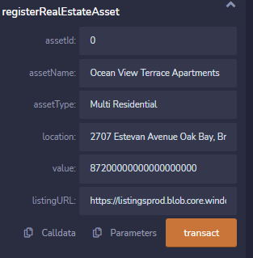
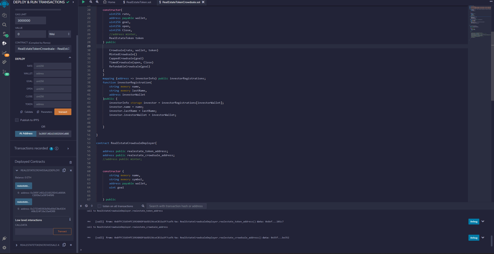
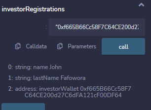
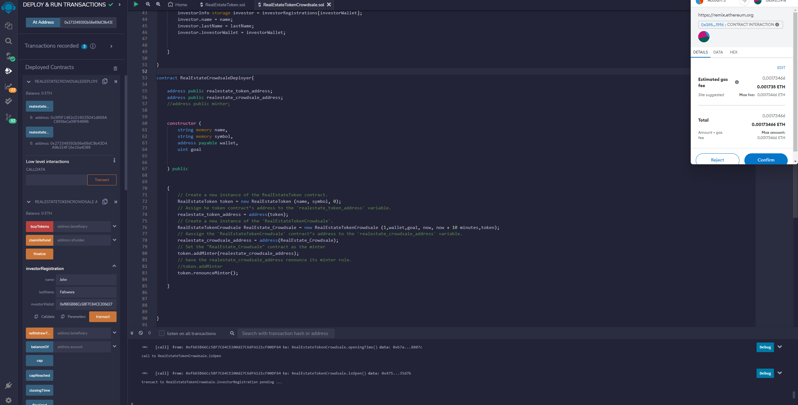

# Project-3--Real-Estate-Tokenization-SmartContract

<br>
<br>

Our Real Estate Tokenization smart contract in its most basic sense involves the digital fractional representation of real estate asset rights and ownership on the Ethereum blockchain platform where individuals can subscribe to a percentage ownership whilst the crowdsale is open and active. Real estate tokenization employs Distributed Ledger Technology of blockchain and smart contracts to buy into, execute and record transfers of real property ownership in a pool that is faster, cheaper, and overall more efficient than what is currently available in the traditional market.<br> 
 
While we intend to get the contract market ready, we are still short of additional information that is required to run it on the live network, Nonetheless, our contract has be repeatedly tested and with a few assumptions is capable of simulating realtime, real-life Tokenization, Crowdsale and transfer activities of a real estate smart contract

## overview 
It has been argued that real estate investments provides by far the best return in financial investments. However, the capital intensive nature of real estate investments has excluded several would be investors. As such, the tokenization initiative for real estate will make it more affordable to the public. There are several more benefits and gains to be had with the tokenization of real-estate including:
<br>

### 1. Transparency -
The decentralized structure of blockchains and the transparency that comes with it is of significant benefits to real estate transactions. In tokenized purchases,  each sale is easily documented and can be safely tracked without need for human interaction. Automated smart contracts also eliminates any underhand deals, dodgy transactions and overinflated prices
<br>
<br>

### 2. Efficiency 
The use of a crowdsale function eliminates almost all human interactions, removing limitations such office opening and closing hours, price, rate, etc. that would have been provided by Estate Agents. Similarly once the intended goal has been reached, investors are unable to participate in the transaction and there is no option of oversubscription
<br>
<br>

### 3. Opportunity for small scale investors
The use of tokenization significantly helps in reducing expensive assets into small percentage fractions that is more affordable. This will greatly increase the interest in the asset and help generate the required capital faster. 
<br>
<br>

### 4. More Liquid assets 
In the same vein as above the real estate tokens can be traded easily on the market as they are less capital intensive. There is also the possibility of creating and managing a secondary market of such trades via auctions.
<br>
<br>

## Contracts Functionality
###  Real Estate Token
The libraries imported for the Token contract was ERC 20, ERC20 Detailed, ERC20Mintable, and AccessControl all from the Open Zepeelin contracts
As part of the contract a struct was created to house all associated variable needed in mapping the RealEstateAsset. 
With the Asset registrationfunction we are able to register the asset by providing all required variable information. We are currently importing sample listing with already canned information. 
<br>
There is also a mint function which helps in creating the real estate token that will be linked to the crowdsale contract 
<br>

### Real Estate Crowdsale
The libraries imported for the Token Crowdsale contract was Crowdsale, Minted Crowdsale Capped Crowdsale, Timed Crowdsale and Refundable PostDelivery Crowdsale all from the Open Zepeelin contracts
We also imported the Real Estate Token Contract
There is a crowdsale strcut that maps variable to the investor registration function.<br>
The investor registration function will allow all interested to register as part of a KYC process.
<br>
<br>

## overview of what the smart contracts does:
```
owner
Asset Registration
crowdsale Parameters
functions available to owner
RegisterRealEstate
balanceOf
name
weiRaised
InvestorRegistration(returns Investor info)
Investor
Investor Registration
realEstateAsset
Rate
Symbol
Is Open
Is Closed
buyTokens
```
<br>
<br>

## Resources
import "./RealEstateToken.sol";
<br>import "https://github.com/OpenZeppelin/openzeppelin-contracts/blob/release-v2.5.0/contracts/crowdsale/Crowdsale.sol";
<br>import "https://github.com/OpenZeppelin/openzeppelin-contracts/blob/release-v2.5.0/contracts/crowdsale/emission/MintedCrowdsale.sol";
<br>import "https://github.com/OpenZeppelin/openzeppelin-contracts/blob/release-v2.5.0/contracts/crowdsale/validation/CappedCrowdsale.sol";
<br>import "https://github.com/OpenZeppelin/openzeppelin-contracts/blob/release-v2.5.0/contracts/crowdsale/validation/TimedCrowdsale.sol";
<br>import "https://github.com/OpenZeppelin/openzeppelin-contracts/blob/release-v2.5.0/contracts/crowdsale/distribution/RefundablePostDeliveryCrowdsale.sol";
<br>import "https://github.com/OpenZeppelin/openzeppelin-contracts/blob/release-v2.5.0/contracts/token/ERC20/ERC20.sol";
<br>import "https://github.com/OpenZeppelin/openzeppelin-contracts/blob/release-v2.5.0/contracts/token/ERC20/ERC20Detailed.sol";
<br>import "https://github.com/OpenZeppelin/openzeppelin-contracts/blob/release-v2.5.0/contracts/token/ERC20/ERC20Mintable.sol";
<br>import "https://github.com/OpenZeppelin/openzeppelin-contracts/blob/release-v2.5.0/contracts/access/AccessControl.sol";
<br>import "https://github.com/OpenZeppelin/openzeppelin-contracts/blob/master/contracts/access/AccessControl.sol";
<br>
<br>

## Frontend dApp
Streamlit
<br>
<br>

## Test results

<br>
<br>


<br>
<br>


<br>
<br>


<br>
<br>


<br>
<br>


<br>
<br>


<br>
<br>


<br>
<br>


<br>
<br>

## Conclusion
While the smart contract executes as expected there is need to build detailed products there is the choice of marketing the contract as a private label to be used by specific real estate companies or on the other hand we will explore the options or researching the real estate market and coming up with assets that will be a perfect fit for launching the real estate tokenization project 
